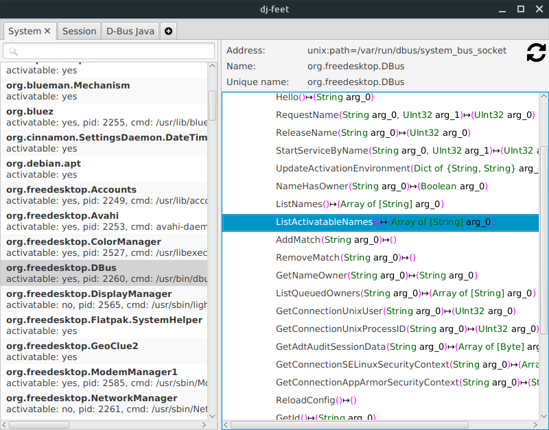
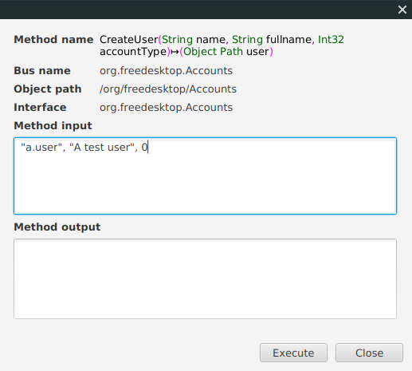

# dj-feet  

A cross-platform, JavaFX based clone of [D-Feet](https://wiki.gnome.org/Apps/DFeet/), the D-Bus debugger provided by GNOME on Linux. It makes use of [dbus-java](https://github.com/hypfvieh/dbus-java), allowing you to debug your D-Bus application on any major desktop operating system.

## Installation

Installers are provided for Linux, Windows and Mac OS. Download and run the GUI installers appropriate for your desktop.

 * [Linux Installer](https://github.com/bithatch/dj-feet/releases/download/1.0.2/dj-feet_unix_1_0_2.sh)  
 * [Mac OS Installer](https://github.com/bithatch/dj-feet/releases/download/1.0.2/dj-feet_macos_1_0_2.dmg)  
 * [Windows Installer](https://github.com/bithatch/dj-feet/releases/download/1.0.2/dj-feet_windows-x64_1_0_2.exe)

## Usage

What is available when you start the application will depend on the operating system you are on. 

 * On any operating system, if you have installed the provided default `dbus-java-daemon`, it will also be shown.
 
 * Linux, you will see the *System Bus*, and the *Session Bus* by default. 
 
 * If there are no default buses available, you will be immediately prompted for a bus address.

Other features include :-

 * Filter bus names by typing in the search box at the top-left of the user interface.
 
 * Select a bus in the left hand pane to view the available objects exported on that base.
 
 * Expand the tree nodes on the right to view *Methods*, *Signals* and *Properties*. 
 
 * Double-click on a *Method* to execute it. The *Method Input* box accepts multiple comma separated parameters, you must supply all arguments a Method expects. Arguments are parsed using the [Spring Expression Language](https://docs.spring.io/spring-framework/docs/3.2.x/spring-framework-reference/html/expressions.html). In practice, format arguments similiarly to you would using Java.
   
   
    
 * Double-click on a *Property* to view it's current value. Values cannot currently be set.

### Other Tools Installed

With the installers, also included are easy launchers for all of the [dbus-java-utils](https://github.com/hypfvieh/dbus-java/tree/master/dbus-java-utils) tools.

 * `dbus-java-daemon` and `dbus-java-daemonc`. A replacement daemon you can use as a broker for operating systems that don't already have one. The former is installed as a service, and the latter as a command line tool you can just run when needed.
 * `dbus-java-list`. Just list all exported names.
 * `dbus-java-caller`. Invoke dbus methods.          
 * `dbus-java-create-interface`. Geneate a Java interface from exported objects. DEPRECATED
 * `dbus-java-interface-code-generator`. Geneate a Java interface from exported objects.
 * `dbus-java-viewer`. Simple Swing UI based viewer.
 * `dbus-java-type-string-to-java`. Convert a DBus type string to Java.
 
## Changes

### 1.0.2

 * Windows dj-feet not automatically loading `dbus-java-daermon` if it is installed.
 * Re-install may fail on Windows due to JRE file being in use.
 * Better internal monitoring of bus events.

### 1.0.1

 * Windows had incorrect classpath for dj-feet.exe.

### 1.0.0

 * Initial release

## Development

Find the source and submit pull requests at the GitHub project page, you know the drill.

## License

dj-feet is made available under [GPL version 3](https://www.gnu.org/licenses/gpl-3.0.en.html). Other components under their respective licenses. 

## Attribution

Bus Icon made by [Royyan Wijaya](https://www.flaticon.com/authors/royyan-wijaya) from [www.flaticon.com](https://www.flaticon.com/)
